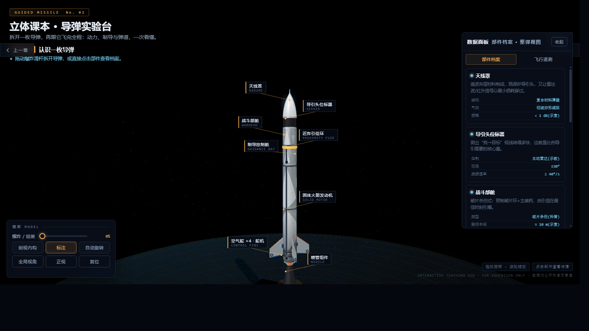
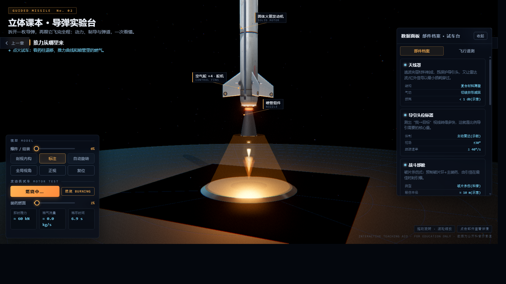

<div align="center">

# 🚀 立体课本 · 导弹实验台

**dap-pap** — Drag-and-drop Automobile... 不，是 **D**ynamic **A**erospace **P**layground · **P**ropulsion **A**nd **P**athfinding

### 一个完全开源的交互式导弹原理 3D 教具

拆开一枚导弹，再跟它飞完全程：动力、制导与弹道，一次看懂。

[](https://github.com/chenbenkong/dap-pap/actions/workflows/deploy.yml)
[](LICENSE)
[](https://threejs.org/)
[](https://www.typescriptlang.org/)
[](https://vitejs.dev/)

**🌐 在线演示：<https://chenbenkong.github.io/dap-pap/>**

*无需安装 · 无需登录 · 双击即用的网页应用*

</div>

---

## 📖 这是什么？

这是一个面向**科普教育**的交互式 3D 教具。它把一枚通用战术导弹"拆开"呈现在你面前：

- 🧩 **结构解剖** —— 8 大舱段任意爆炸/组装，剖视内部构造，每个部件都有图文档案
- 🔥 **动力原理** —— 固体火箭发动机点火试车，实时推力/燃气流量曲线，星型药柱肉眼可见地燃烧退移
- 🎯 **制导追击** —— 比例导引律驱动的追击演示，视线连线、预测命中点、命中爆炸全流程
- 🛰️ **全程弹道** —— 从点火到命中的完整任务模拟：助推/中段/末段三阶段，跟弹视角 + 全局弹道 + 时间轴

整个项目**零外部资源依赖**：没有加载任何 3D 模型文件、贴图文件——导弹的每一颗铆钉、每一段舱缝、每一块喷涂标识，全部由代码程序化生成。

## 📸 预览

| 全景 · 机库展台 | 细节 · PBR 蒙皮与舱段 |
| :---: | :---: |
|  |  |

## ✨ 功能特性

### 第 1 章 · 结构解剖
- **8 大舱段**：天线罩 / 导引头位标器 / 战斗部舱 / 近炸引信环 / 制导控制舱 / 固体火箭发动机 / 喷管组件 / 空气舵×4
- **爆炸视图滑杆**：0~100% 连续控制拆装动画，每个舱段沿装配轴分离
- **剖视内构**：基于裁剪平面（clipping plane）的实时剖切，露出内部件——万向支架上的导引头天线、预制破片环、电路板组、IMU、点火器、星型药柱……
- **部件档案**：点击 3D 部件或左侧卡片，右侧面板同步展示该部件的作用说明 + 技术参数表 + 深度解读
- **3D 标注**：跟随视角浮动的中文/英文双语部件标签，带引线锚点

### 第 2 章 · 动力原理
- 点火试车：推力曲线实时绘制，**程序化体积火焰**（自定义 GLSL + FBM 湍流噪声 + 视线厚度近似）+ 火花粒子 + 动态点光源
- **装药燃面滑杆**：手动控制药柱燃烧进程，星型内燃药柱几何体实时重建——直观理解"燃面 → 推力"的关系
- 遥测面板：即时推力（kN）、燃气流量（kg/s）、燃尽时间

### 第 3 章 · 制导追击
- 海面目标舰做规避机动，导弹以**比例导引律（Proportional Navigation）**追击
- 可视化：视线连线（LOS）、预测命中点光环
- 命中判定 + 爆炸特效（火球 + 冲击波 + 破片）

### 第 4 章 · 全程弹道
- 指数大气模型（密度随高度衰减）+ 音速近似下的**完整弹道积分**
- 助推段 → 中段 → 末段三阶段自动切换，时间轴可拖动回放
- 跟弹视角 / 全局弹道双机位，×1/×2/×4 变速
- 末端俯冲 + 命中海上目标的完整闭环

### 通用
- 🖱️ 轨道相机：拖动旋转 / 滚轮缩放 / 自动旋转
- 🌗 深色战术蓝图风格 UI，响应式布局（桌面 / 移动端适配）
- 🎬 章节间相机飞行动画与转场提示
- 🐛 调试/演示深链：
  - `#view=x,y,z|tx,ty,tz` — 直取任意相机机位
  - `#chapter=2&ignite=1` — 进入点火试车页面并自动点火
  - `#chapter=4&launch=1` — 进入任务弹道页面并自动发射

## 🛠️ 技术栈

| 层 | 技术 | 说明 |
|---|---|---|
| 语言 | **TypeScript 5** | 渐进式类型（宽松策略，核心接口有类型） |
| 3D 引擎 | **Three.js r160** | WebGL 渲染、PBR 材质、后期处理 |
| 构建 | **Vite 5** | 开发热更 / 生产构建 / 预览 |
| 部署 | **GitHub Actions + Pages** | push 即自动构建发布，零运维 |
| 后期 | EffectComposer + UnrealBloom + OutputPass + FXAA + ColorGradePass | ACES 色调映射，色散/暗角/胶片颗粒 |

## 🏗️ 项目结构

```
dap-pap/
├── index.html                  # 应用骨架：加载屏 / 顶栏 / 数据面板 / 控制台 / 全部样式
├── vite.config.ts              # Vite 配置（Pages base 路径在这里改）
├── tsconfig.json
├── package.json
├── docs/img/                   # README 截图
├── .github/workflows/deploy.yml# push → 构建 → 发布 Pages
└── src/
    ├── main.ts                 # 入口：章节调度 · UI 绑定 · 标注投影 · 遥测 · 相机导演 · 主循环
    ├── scene.ts                # 场景与渲染：双舞台（机库 hangar / 飞行世界 world）、IBL 环境光、
    │                           #   阴影、后期处理链、相机飞行动画、屏幕震动
    ├── parts.ts                # 导弹建模：程序化 PBR 蒙皮贴图（舱缝/铆钉/喷涂）、切线卵形天线罩、
    │                           #   翼型弹翼+滚转舵、星型药柱、拉瓦尔喷管、爆炸/剖视/舵偏 API
    ├── effects.ts              # 特效：发动机羽流（马赫盘+火花+光）、弹道拖尾、命中爆炸、目标舰
    └── flight.ts               # 飞行物理：指数大气模型、追击模拟 StrikeSim（比例导引）、
                                #   全弹道积分 MissionSim（助推/中段/末段）、拦截点预测
```

## 🧠 核心技术亮点

### 1. 零资源程序化建模
不加载任何模型/贴图文件，导弹完全由代码"长"出来：

- **PBR 程序化蒙皮**：Canvas 生成 1024×2048 反照率图 + 512×1024 粗糙度图 + 金属度图 + 高度→法线图；覆盖舱段缝/双排铆钉/检修盖板/NO STEP / LIFT HERE 喷涂/漆面剥落露裸金属/尾部烟熏/磨损流痕；UV 沿弹体全局坐标映射，8 个舱段爆炸分离后漆面依然连续
- **真实气动外形**：切线卵形（tangent ogive）头部曲线、船尾收锥、拉瓦尔喷管（Catmull-Rom 样条平滑轮廓）、**沿展向放样的真实翼型弹翼**（弦长/厚度收缩、前缘后掠）+ 翼尖滚转舵（rolleron）
- **能烧的药柱**：8 角星型内燃装药截面，燃烧时几何体按燃面退移规律实时重建

### 2. 简化但严谨的飞行物理
- 指数大气密度模型 `ρ(h) = 1.225·e^(−h/8500)`（国际标准大气近似）
- 音速近似 `a(h) ≈ 340 − 0.0038h`
- 比例导引：舵令 ∝ 视线角速率 q̇（正是第 1 章导引头部件讲解的核心量，前后呼应）
- 全弹道数值积分，助推/中段/末段按质量与推力状态自动切换

> ⚠️ 所有参数均为**公开科普示意值**，不针对任何真实型号，教学演示用途。

### 3. 剖视 = 材质级裁剪
剖视内构不是"把壳变透明"，而是用 `WebGLRenderer.localClippingEnabled` + 裁剪平面只切外壳材质——切口干净、内部件完整、帧率无感。

## 🚀 快速开始

```bash
# 1. 克隆
git clone https://github.com/chenbenkong/dap-pap.git
cd dap-pap

# 2. 安装依赖（需要 Node.js ≥ 18）
npm install

# 3. 开发模式（热更新）
npm run dev

# 4. 生产构建 + 本地预览
npm run build
npm run preview
```

浏览器打开终端里显示的地址即可。推荐使用最新版 Chrome / Edge / Firefox。

## ☁️ 部署你自己的实例

1. **Fork** 本仓库
2. 仓库 **Settings → Pages → Build and deployment → Source** 选择 **GitHub Actions**
3. （如果改了仓库名）同步修改 `vite.config.ts` 里的 `base: '/dap-pap/'`
4. push 任意提交 → Actions 自动构建并发布

## 🎨 二次开发指南

| 想做什么 | 改哪里 |
|---|---|
| 换涂装配色 | `src/parts.ts` → `makeBodyMaps()` 底色 / 喷涂文字 |
| 加/改部件 | `src/parts.ts` → `buildMissile()` 内新增组，再 `reg()` 注册（文案与锚点一并填） |
| 调发动机参数 | `src/parts.ts` 药柱尺寸 / `src/main.ts` 第 2 章推力曲线 |
| 调弹道/导引律 | `src/flight.ts` → `StrikeSim` / `MissionSim` |
| 改相机机位 | `src/main.ts` → `CHAPTERS` 与各章 `snapView` 坐标 |
| 关闭辉光后期 | `src/scene.ts` → `bloomPass.enabled = false` |

## 🗺️ Roadmap

- [ ] 红外成像导引头模式（像点追踪可视化）
- [ ] 多目标拦截饱和演示
- [ ] 移动端手势优化（双指缩放已有，待调参）
- [ ] 英语界面切换
- [ ] 弹道数据 CSV 导出

## 🤝 贡献

欢迎 Issue 与 PR！教学类项目，尤其欢迎：
- 物理模型的改进建议（在"严谨"与"易懂"之间找平衡）
- 更多语言的部件档案文案
- 性能优化（移动端帧率）

## 📄 License

[MIT](LICENSE) —— 可自由用于教学、课件、二次开发与商业场景，请保留版权声明。

## 🙏 致谢

- [three.js](https://threejs.org/) — WebGL 生态的基石
- [Vite](https://vitejs.dev/) — 快到飞起的构建工具
- 所有对科普教育保持热情的人

---

<div align="center">

**INTERACTIVE TEACHING AID · FOR EDUCATION ONLY**

如果这个项目对你有帮助，欢迎点个 ⭐ Star

</div>
