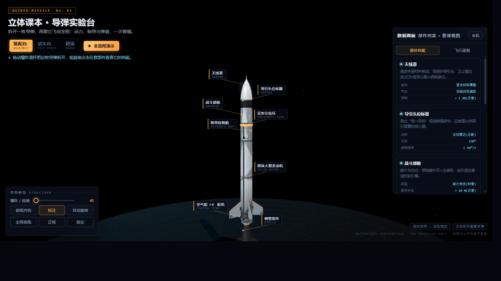
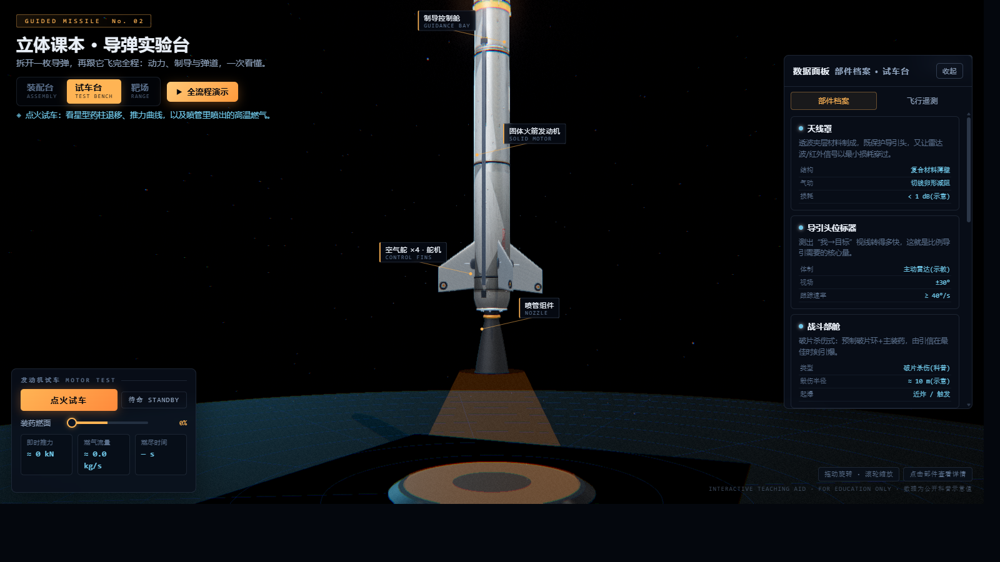
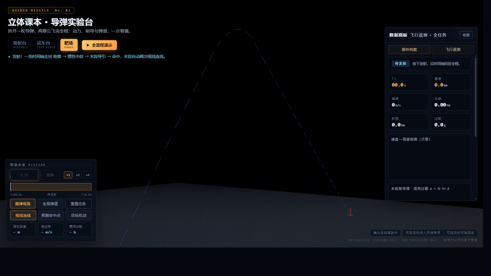

<div align="center">

# 🚀 立体课本 · 导弹实验台

**dap-pap** — Drag-and-drop Automobile... 不，是 **D**ynamic **A**erospace **P**layground · **P**ropulsion **A**nd **P**athfinding

### 一个完全开源的交互式导弹原理 3D 教具

拆开一枚导弹，再跟它飞完全程：动力、制导与弹道，一次看懂。

[](https://github.com/chenbenkong/dap-pap/actions/workflows/deploy.yml)
[](LICENSE)
[](https://threejs.org/)
[](https://www.typescriptlang.org/)
[](https://vitejs.dev/)

**🌐 在线演示：<https://chenbenkong.github.io/dap-pap/>**

*无需安装 · 无需登录 · 双击即用的网页应用*

</div>

---

## 📖 这是什么？

这是一个面向**科普教育**的交互式 3D 教具。它把一枚通用战术导弹放进同一座实验台里，让你沿着一条完整的认知主线走完：

> **先看它是什么做的 → 再看它怎么产生推力 → 最后跟它飞完全程打中目标**

没有割裂的"第 1 章 / 第 2 章"，只有**同一枚导弹在同一个实验台上的三个工位**。切换工位时相机是"走过去"的，不是瞬移——你始终知道自己在看同一件东西。

| 工位 | 回答的问题 | 你可以做什么 |
| :---: | :--- | :--- |
| 🧩 **装配台**<br>`ASSEMBLY` | 这枚导弹是什么做的？ | 拉爆炸滑杆拆成 8 大舱段、开剖视看内构、点任意部件查档案 |
| 🔥 **试车台**<br>`TEST BENCH` | 它怎么产生推力？ | 点火试车、拖药柱燃面滑杆看星型装药退移、读推力/流量曲线 |
| 🎯 **靶场**<br>`RANGE` | 它怎么飞过去并命中？ | 一键发射，从助推飞到命中；末段自动画出视线连线与预测命中点 |

整个项目**零外部资源依赖**：没有加载任何 3D 模型文件、贴图文件——导弹的每一颗铆钉、每一段舱缝、每一块喷涂标识，全部由代码程序化生成。

## 📸 预览

| 🧩 装配台 · 爆炸与剖视 | 🔥 试车台 · 点火与药柱退移 | 🎯 靶场 · 全程弹道与末段导引 |
| :---: | :---: | :---: |
|  |  |  |

## ✨ 功能特性

### 🧩 装配台 · 结构解剖
- **8 大舱段**：天线罩 / 导引头位标器 / 战斗部舱 / 近炸引信环 / 制导控制舱 / 固体火箭发动机 / 喷管组件 / 空气舵×4
- **爆炸视图滑杆**：0~100% 连续控制拆装动画，每个舱段沿装配轴分离
- **剖视内构**：基于裁剪平面（clipping plane）的实时剖切，露出内部件——万向支架上的导引头天线、预制破片环、电路板组、IMU、点火器、星型药柱……
- **部件档案**：点击 3D 部件或左侧卡片，右侧面板同步展示该部件的作用说明 + 技术参数表 + 深度解读
- **3D 标注**：跟随视角浮动的中文/英文双语部件标签，带引线锚点

### 🔥 试车台 · 动力原理
- 点火试车：推力曲线实时绘制，**程序化体积火焰**（自定义 GLSL + FBM 湍流噪声 + 视线厚度近似）+ 火花粒子 + 动态点光源
- **装药燃面滑杆**：手动控制药柱燃烧进程，星型内燃药柱几何体实时重建——直观理解"燃面 → 推力"的关系
- 遥测面板：即时推力（kN）、燃气流量（kg/s）、燃尽时间
- 三段式羽流：外层火焰 / 内层焰心 / 白炽核心分别滚动，形成真实的湍流层次

### 🎯 靶场 · 一次发射走完整条时间轴

原来的"追击演示"和"弹道演示"是两个各说各话的 demo，现在合并成**一次发射的完整时间轴**：

```
点火 → 助推 BOOST → 惯性中段 MIDCOURSE → 末段导引 TERMINAL → 命中 IMPACT
```

- **指数大气模型**（密度随高度衰减）+ 音速近似下的完整弹道积分，预积分后时间轴可任意拖动回放
- **真实目标舰**：舰船按"命中时刻恰好位于命中点"反解运动，所以你看到的拦截不是摆拍——开不开"目标机动"，导弹都得重新算
- **末段导引可视化**：进入末段自动绘制
  - 🔵 **视线连线（LOS）**——导弹与目标之间的视线，这是比例导引律的输入
  - 🎯 **预测命中点光环**——按当前相对运动解出的提前量拦截点
  - 📊 实时读数：剩余距离 / 接近速度 / 需求过载
  - 🎬 相机自动切成"末段特写"，跟着导弹扑向目标
- **飞行 HUD**：阶段、T+ 时间、高度、速度、马赫数、过载、已飞距离、脱靶量，随任务实时刷新
- 命中判定 + 爆炸特效（火球 + 冲击波 + 破片）

### 🎬 全流程演示
点右上角 **▶ 全流程演示**，一键自动串起三个工位：装配台拆弹 → 试车台点火 → 靶场发射 → 命中，全程约 70 秒无人值守，适合直接投屏上课。任意时刻按 `Esc` 或点按钮即可中断接管。

### 通用
- 🖱️ 轨道相机：拖动旋转 / 滚轮缩放 / 自动旋转
- ⌨️ 键盘：`←` `→` 切工位，`空格` 执行当前工位主动作（点火 / 发射），`Esc` 停止演示
- 🌗 深色战术蓝图风格 UI，响应式布局（桌面 / 移动端适配）
- 🎬 工位间相机飞行动画与转场提示，不瞬移
- 🔗 深链直达（可直接嵌进课件 / PPT 链接）：
  - `#station=assembly` · `#station=bench` · `#station=range` — 直达工位
  - `#station=bench?ignite=1` — 进试车台并自动点火
  - `#station=range?launch=1` — 进靶场并自动发射
  - `#show=1` — 打开即播放全流程演示
  - `#view=x,y,z|tx,ty,tz` — 直取任意相机机位
  - 旧链接 `#chapter=1..4` 仍可兼容跳转到对应工位

## 🛠️ 技术栈

| 层 | 技术 | 说明 |
|---|---|---|
| 语言 | **TypeScript 5** | 渐进式类型（宽松策略，核心接口有类型） |
| 3D 引擎 | **Three.js r160** | WebGL 渲染、PBR 材质、后期处理 |
| 构建 | **Vite 5** | 开发热更 / 生产构建 / 预览 |
| 部署 | **GitHub Actions + Pages** | push 即自动构建发布，零运维 |
| 后期 | EffectComposer + UnrealBloom + OutputPass + FXAA + ColorGradePass | ACES 色调映射，色散/暗角/胶片颗粒 |
| 自检 | **esbuild + Node** 无头物理自检 | 不依赖 WebGL，CI 里跑完整弹道回归 |

## 🏗️ 项目结构

```
dap-pap/
├── index.html                  # 应用骨架：加载屏 / 顶栏 / 工位切换 / 数据面板 / 飞行 HUD / 全部样式
├── vite.config.ts              # Vite 配置（Pages base 路径在这里改）
├── tsconfig.json
├── package.json
├── docs/img/                   # README 截图
├── .github/workflows/deploy.yml# push → 类型检查 → 物理自检 → 构建 → 发布 Pages
├── tools/
│   └── selftest.mjs            # 无头自检：把 flight.ts 打进 Node 跑完整任务并断言物理指标
└── src/
    ├── main.ts                 # 入口：工位调度 · UI 绑定 · 标注投影 · 遥测 · 相机导演 · 全流程演示 · 主循环
    ├── scene.ts                # 场景与渲染：双舞台（机库 hangar / 飞行世界 world）、IBL 环境光、
    │                           #   阴影、后期处理链、相机飞行动画、屏幕震动
    ├── parts.ts                # 导弹建模：程序化 PBR 蒙皮贴图（舱缝/铆钉/喷涂）、切线卵形天线罩、
    │                           #   翼型弹翼+滚转舵、星型药柱、拉瓦尔喷管、爆炸/剖视/舵偏 API
    ├── effects.ts              # 特效：三段式体积火焰羽流、弹道拖尾、命中爆炸、目标舰
    └── flight.ts               # 飞行物理：指数大气模型、比例导引 StrikeSim、
                                #   全弹道积分 MissionSim（助推/中段/末段/过载包线）、拦截点预测
```

## 🧠 核心技术亮点

### 1. 零资源程序化建模
不加载任何模型/贴图文件，导弹完全由代码"长"出来：

- **PBR 程序化蒙皮**：Canvas 生成 1024×2048 反照率图 + 512×1024 粗糙度图 + 金属度图 + 高度→法线图；覆盖舱段缝/双排铆钉/检修盖板/NO STEP / LIFT HERE 喷涂/漆面剥落露裸金属/尾部烟熏/磨损流痕；UV 沿弹体全局坐标映射，8 个舱段爆炸分离后漆面依然连续
- **真实气动外形**：切线卵形（tangent ogive）头部曲线、船尾收锥、拉瓦尔喷管（Catmull-Rom 样条平滑轮廓）、**沿展向放样的真实翼型弹翼**（弦长/厚度收缩、前缘后掠）+ 翼尖滚转舵（rolleron）
- **能烧的药柱**：8 角星型内燃装药截面，燃烧时几何体按燃面退移规律实时重建

近距离看蒙皮——舱段缝、双排铆钉、检修盖板、漆面剥落露出的裸金属，全部是 Canvas 画出来的，不是贴图文件：


### 2. 简化但严谨的飞行物理
- 指数大气密度模型 `ρ(h) = 1.225·e^(−h/8500)`（国际标准大气近似）
- 音速近似 `a(h) ≈ 340 − 0.0038h`
- 比例导引律 `a = N·Vc·λ̇`，视线角速率由 `ω = (r × ṙ)/|r|²` 解出（正是装配台里"导引头位标器"讲解的核心量，前后呼应）
- 全弹道数值积分，助推/中段/末段按质量与推力状态自动切换
- **过载严格区分轴向与横向**：助推段报告弹体轴向载荷（约 16 G，真实战术导弹同量级），末段报告垂直于速度的机动过载（受气动舵能力 `nMax` 约束，满舵 12 G）。二者物理含义不同，不能混为一谈——这点第一个版本就算错过，是无头自检抓出来的

### 3. 物理层可被自动验证
3D 效果好不好看，截图说了算；物理对不对，得靠断言。`tools/selftest.mjs` 用 esbuild 把 `flight.ts` 打进 Node，不开浏览器跑完整任务，断言 26 项：

```bash
npm run selftest
```

```
全程任务弹道 MissionSim
  ✓ 弹道采样点已生成  3494 点
  ✓ 任务时长落在合理区间  69.9 s
  ✓ 射程落在合理区间  27.2 km
  ✓ 弹道顶点高于 1 km  13.61 km
  ✓ 飞出超音速  Ma 3.19
  ✓ 全部采样点数值有限（无 NaN / Infinity）
  ✓ 四个飞行阶段全部出现  phases=[0,1,2,3]
  ✓ 阶段时序单调递增  助推→7.2s  中段→17.5s  命中→69.9s
  ✓ 末段落点偏差 < 2% 射程  落点 x=27.19km  目标 27.2km  偏差 6m
  ✓ 轴向过载落在弹体结构可承受区间  峰值 15.9 G（助推段 15.9 G）
  ✓ 末段横向机动过载未超出气动舵极限  12.0 G / 极限 12 G
  ...
结果  26 通过  0 失败
```

改了导引律或弹道参数，跑一遍就知道有没有把物理搞崩。CI 里每次 push 都会执行。

> ⚠️ 所有参数均为**公开科普示意值**，不针对任何真实型号，教学演示用途。

### 4. 剖视 = 材质级裁剪
剖视内构不是"把壳变透明"，而是用 `WebGLRenderer.localClippingEnabled` + 裁剪平面只切外壳材质——切口干净、内部件完整、帧率无感。

## 🚀 快速开始

```bash
# 1. 克隆
git clone https://github.com/chenbenkong/dap-pap.git
cd dap-pap

# 2. 安装依赖（需要 Node.js ≥ 18）
npm install

# 3. 开发模式（热更新）
npm run dev

# 4. 生产构建 + 本地预览
npm run build
npm run preview
```

浏览器打开终端里显示的地址即可。推荐使用最新版 Chrome / Edge / Firefox。

### 可用脚本

| 命令 | 作用 |
|---|---|
| `npm run dev` | 开发服务器（热更新） |
| `npm run build` | 生产构建到 `dist/` |
| `npm run preview` | 本地预览构建产物 |
| `npm run typecheck` | TypeScript 类型检查 |
| `npm run selftest` | 无头物理自检（不开浏览器，约 2 秒） |
| `npm run verify` | 类型检查 + 物理自检 + 构建，一条龙 |

## ☁️ 部署你自己的实例

1. **Fork** 本仓库
2. 仓库 **Settings → Pages → Build and deployment → Source** 选择 **GitHub Actions**
3. （如果改了仓库名）同步修改 `vite.config.ts` 里的 `base: '/dap-pap/'`
4. push 任意提交 → Actions 自动构建并发布

## 🎨 二次开发指南

| 想做什么 | 改哪里 |
|---|---|
| 换涂装配色 | `src/parts.ts` → `makeBodyMaps()` 底色 / 喷涂文字 |
| 加/改部件 | `src/parts.ts` → `buildMissile()` 内新增组，再 `reg()` 注册（文案与锚点一并填） |
| 调发动机参数 | `src/parts.ts` 药柱尺寸 / `src/main.ts` 推力曲线 |
| 调弹道/导引律 | `src/flight.ts` → `StrikeSim` / `MissionSim`，改完跑 `npm run selftest` |
| 加/改工位 | `src/main.ts` → `STATIONS` 与 `STATION_ORDER`，同步在 `index.html` 加按钮与面板分组 |
| 改工位相机机位 | `src/main.ts` → `STATIONS[key].cam` / `.tgt` |
| 调全流程演示节奏 | `src/main.ts` → `runFullShow()` 的各步延时 |
| 加物理断言 | `tools/selftest.mjs`，按现有 `ok(cond, label, extra)` 风格追加 |
| 关闭辉光后期 | `src/scene.ts` → `bloomPass.enabled = false` |

## 🗺️ Roadmap

- [x] 三工位单舞台架构（装配台 / 试车台 / 靶场）
- [x] 一次发射走完整条时间轴 + 真实目标舰
- [x] 末段导引可视化（视线连线 / 预测拦截点 / 末段特写机位）
- [x] 飞行 HUD 与全流程自动演示
- [x] 无头物理自检 + CI 门禁
- [ ] 红外成像导引头模式（像点追踪可视化）
- [ ] 多目标拦截饱和演示
- [ ] 移动端手势优化（双指缩放已有，待调参）
- [ ] 英语界面切换
- [ ] 弹道数据 CSV 导出

## 🤝 贡献

欢迎 Issue 与 PR！教学类项目，尤其欢迎：
- 物理模型的改进建议（在"严谨"与"易懂"之间找平衡）
- 更多语言的部件档案文案
- 性能优化（移动端帧率）

## 📄 License

[MIT](LICENSE) —— 可自由用于教学、课件、二次开发与商业场景，请保留版权声明。

## 🙏 致谢

- [three.js](https://threejs.org/) — WebGL 生态的基石
- [Vite](https://vitejs.dev/) — 快到飞起的构建工具
- 所有对科普教育保持热情的人

---

<div align="center">

**INTERACTIVE TEACHING AID · FOR EDUCATION ONLY**

如果这个项目对你有帮助，欢迎点个 ⭐ Star

</div>
